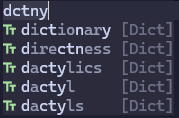
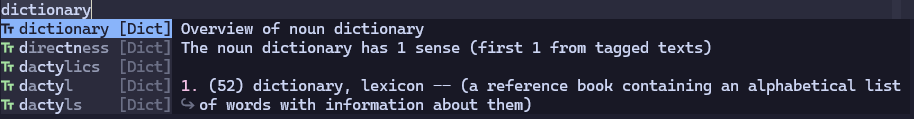

# blink-cmp-dictionary

Dictionary source for [blink.cmp](https://github.com/Saghen/blink.cmp)
completion plugin. This makes it possible to query a dictionary
without leaving the editor.

Fuzzy finding is supported by default:



Definitions of words are also supported (use `wn` by default):



## Requirements

For the default configuration, you must have `fzf` to search in the dictionary file. And `wn` must
be installed to get the definitions of words. `cat` for concatenating the dictionary files.

If you have no `cat` in your system, see [How to custom the command](#how-to-custom-the-command).

## Installation

Add the plugin to your packer managers, and make sure it is loaded before `blink.cmp`.

### `lazy.nvim`

```lua
{
    'saghen/blink.cmp',
    dependencies = {
        {
            'Kaiser-Yang/blink-cmp-dictionary',
            dependencies = { 'nvim-lua/plenary.nvim' }
        }
        -- ... Other dependencies
    },
    opts = {
        sources = {
            -- Add 'dictionary' to the list
            default = { 'dictionary', 'lsp', 'path', 'luasnip', 'buffer' },
            providers = {
                dictionary = {
                    module = 'blink-cmp-dictionary',
                    name = 'Dict',
                    -- Make sure this is at least 2.
                    -- 3 is recommended
                    min_keyword_length = 3,
                    opts = {
                        -- options for blink-cmp-dictionary
                    }
                }
            },
        }
    }
}
```

## Quick Start

By default, your dictionary files must be like this content (every line is a word):

```txt
word1
word2
```

If you dictionary files are like these. You just need to specify the dictionary files'
path in the configuration:

```lua
-- Specify the dictionary files' path
-- example: { vim.fn.expand('~/.config/nvim/dictionary/words.dict') }
dictionary_files = nil,
-- All .txt files in these directories will be treated as dictionary files
-- example: { vim.fn.expand('~/.config/nvim/dictionary') }
dictionary_directories = nil,
```

> [!NOTE]
>
> All the dictionary files in `dictionary_files` and `dictionary_directories` will be
> concatenated by `cat` command. Make sure the files are different, otherwise there will be
> duplicate words in the completion list. If your dictionary files are not separated by lines,
> see [How to custom completion items](#how-to-custom-completion-items)

## Default Configuration

See [default.lua](./lua/blink-cmp-dictionary/default.lua).

## Q&A

### Why use `fzf` as default? `blink.cmp` already supports fuzzy finding

In `blink-cmp-dictionary` we use `get_prefix` to determine which part to search. If we do not use
`fzf`, for example we use `rg`, and we set `min_keyword_length=3`. After inputting 'dic',
`blink.cmp` will get all the words that start with 'dic', then `blink.cmp` will fuzzy find on
words starting with 'dic'. The process makes it impossible to complete 'dictionary'
when inputing 'dit'. But if we use `fzf`, `fzf` will return 'dictionary' when inputting `dit`
('dit' is a sub-sequence of 'dictionary'). So the fuzzy finding feature are fully supported.

### How to custom completion items

By default, `blink-cmp-dictionary` treat every line in the dictionary files as a completion item.
You can update this by use `separate_output` in the configuration:

```lua
separate_output = function(output)
    local items = {}
    -- You may need to change the pattern to match your dictionary files
    for line in output:gmatch("[^\r\n]+") do
        table.insert(items, {
            label = line,
            insert_text = line,
            -- If you want to disable the documentation feature, just set it to nil
            documentation = {
                get_command = 'wn',
                get_command_args = {
                    line,
                    '-over'
                },
                resolve_documentation = function(output)
                    return output
                end
            }
        })
    end
    return items
end
```

### How to custom the command

By default, `blink-cmp-dictionary` will use `fzf` to read from the output of `cat`. If you do not
have `cat` in your system, you may have other commands to output the content of files, just create
a symbolic link named `cat` to the command you use.

You may configure a new command which supports reading from files directly, for example, `rg`:

```lua
-- set them with nil to pass files directly to the command
dictionary_files = nil,
dictionary_directories = nil,
get_command = 'rg',
get_command_args = function(prefix)
    local dictionary_file1 = 'path/to/your/dictionary/file1'
    local dictionary_file2 = 'path/to/your/dictionary/file2'
    return {
        '--color=never',
        '--no-line-number',
        '--no-messages',
        '--no-filename',
        '--smart-case',
        '--',
        prefix,
        -- pass the dictionary files to the command
        dictionary_file1,
        dictionary_file2,
    }
end
```

If you just want to custom the arguments for `fzf` , for example, those below will ignore the case:

```lua
get_command_args = function(prefix)
    return {
        '--filter=' .. prefix,
        '--sync',
        '--no-sort',
        '-i' -- -i to ignore case, +i to respect case, with no this line is smart case
    }
end,
```

## Performance

`blink-cmp-dictionary` is asynchronous by default, so it should not block other operations.
But there are something you should note:

- Make sure the `min_keyword_length` is at least 2. If your dictionary files are very large,
  a larger value is recommended. This is mainly because `blink-cmp-dictionary` actually
  can handle this quickly, but there will be too many results return to `blink.cmp`, which
  will make `blink.cmp` take a long time to fuzzy find the results.
- Optionally, you can limit the number of items shown in the completion menu.

```lua
opts = {
    sources = {
        providers = {
            dictionary = {
                -- Add this and change the value to your own preference
                max_items = 8,
            }
        },
    }
}
```

## Version Introduction

The release versions are something like `major.minor.patch`. When one of these numbers is increased:

* `patch`: bugs are fixed or docs are added. This will not break the compatibility.
* `minor`: compatible features are added. This may cause some configurations `deprecated`, but
not break the compatibility.
* `major`: incompatible features are added. All the `deprecated` configurations will be removed.
This will break the compatibility.

## Acknowledgment

Nice and fast completion plugin: [blink.cmp](https://github.com/Saghen/blink.cmp).

Inspired by [cmp-dictionary](https://github.com/uga-rosa/cmp-dictionary).

Learned how to write a source from [blink-ripgrep.nvim](https://github.com/mikavilpas/blink-ripgrep.nvim).
