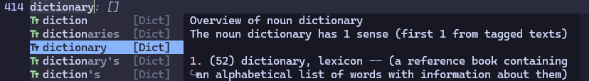

# blink-cmp-dictionary

Dictionary source for [blink.cmp](https://github.com/Saghen/blink.cmp)
completion plugin. This makes it possible to query a dictionary
without leaving the editor.



## Installation

Add the plugin to your packer managers, and make sure it is loaded before `blink.cmp`.

### `lazy.nvim`

```lua
{
    'saghen/blink.cmp',
    dependencies = {
        'Kaiser-Yang/blink-cmp-dictionary',
        -- ... other dependencies
    },
    opts = {
        sources = {
            -- add 'dictionary' to the list
            default = { 'dictionary', 'lsp', 'path', 'luasnip', 'buffer' },
            dictionary = {
                module = 'blink-cmp-dictionary',
                name = 'Dict',
            }
        }
    }
}
```

## Configuration

Those below are the default values for the configuration:

```lua
{
    -- get_prefix is a function that will return the content before the cursor,
    -- see `default.lua` for how it works

    prefix_min_len = 3,
    -- output will be separated by vim.split(result.stdout, output_separator)
    output_separator = '\n',
    documentation = {
        enable = false,
    }
}
```

The default configuration will not work, so you must configure at least the `get_command` option:

```lua
---@module 'blink.cmp'
---@type blink.cmp.Config
opts = {
    sources = {
        providers = {
            dictionary = {
                module = 'blink-cmp-dictionary',
                name = 'Dict',
                --- @module 'blink-cmp-dictionary'
                --- @type blink-cmp-dictionary.Options
                opts = {
                    get_command = {
                        'rg', -- make sure this command is available in your system
                        '--color=never',
                        '--no-line-number',
                        '--no-messages',
                        '--no-filename',
                        '--ignore-case',
                        '--',
                        '${prefix}', -- this will be replaced by the result of 'get_prefix' function
                        vim.fn.expand('~/.config/nvim/dict/en_dict.txt'), -- where you dictionary is
                    },
                    documentation = {
                        enable = true, -- enable documentation to show the definition of the word
                        get_command = {
                            'wn', -- make sure this command is available in your system
                            '${word}', -- this will be replaced by the word to search
                            '-over'
                        }
                    }
                }
            }
        }
    }
}
```

In this example, the dictionary source is configured to search in the file
`~/.config/nvim/dict/en_dict.txt`. After searching, the source will use `wn` to
get the definition of the word. You can update the `get_command` to use other
commands to search in the dictionary.

Many of the options can be a function, you can check the very beginning of
[init.lua](./lua/blink-cmp-dictionary/init.lua) to get an idea of how to use.

To see how I configured my dictionary: [blink-cmp-dictionary](https://github.com/Kaiser-Yang/dotfiles/commit/bdda941b06cce5c7505bc725f09dd3fa17763730).

## Acknowledgment

Nice and fast completion plugin: [blink.cmp](https://github.com/Saghen/blink.cmp).

Inspired by [cmp-dictionary](https://github.com/uga-rosa/cmp-dictionary).

Learned how to write a source from [blink-ripgrep.nvim](https://github.com/mikavilpas/blink-ripgrep.nvim).
