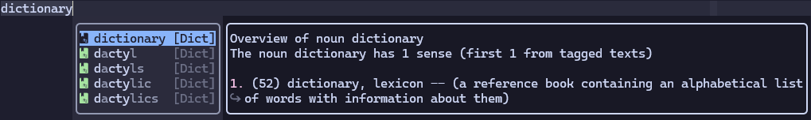

# blink-cmp-dictionary

Dictionary source for [blink.cmp](https://github.com/Saghen/blink.cmp)
completion plugin. This makes it possible to query a dictionary
without leaving the editor.

Fuzzy finding is supported by default:


Definitions of words are also supported (use `wn` by default):



## Installation

Add the plugin to your packer managers, and make sure it is loaded before `blink.cmp`.

### `lazy.nvim`

```lua
{
    'saghen/blink.cmp',
    dependencies = {
        {
            'Kaiser-Yang/blink-cmp-dictionary',
            dependencies = { 'nvim-lua/plenary.nvim' }
        }
        -- ... Other dependencies
    },
    opts = {
        sources = {
            -- Add 'dictionary' to the list
            default = { 'dictionary', 'lsp', 'path', 'luasnip', 'buffer' },
            dictionary = {
                module = 'blink-cmp-dictionary',
                name = 'Dict',
                -- Make sure this is at least 2.
                -- 3 is recommended
                min_keyword_length = 3,
            }
        }
    }
}
```

## Requirements

For the default configuration, you must have `fzf` to search in the dictionary file. And `wn` must
be installed to get the definitions of words.

## Configuration

Those below are the default values for the configuration:

```lua
--- @module 'blink-cmp-dictionary'
--- @type blink-cmp-dictionary.Options
{
    async = true, -- if the source is asynchronous

    -- get_prefix is a function that will return the content before the cursor,

    -- where the dictionary files are
    -- All the text files (end with .txt) will be passed to the standard input of the next command
    -- by cat command. You can place your dictionary files in this directory or specify the
    -- dictionary_directories to point to the directory where your dictionary files are.
    dictionary_directories = { vim.fn.expand('~/.config/nvim/dict') },

    get_command = 'fzf',

    get_command_args = function(prefix)
        return {
            '--filter=' .. prefix,
            '--sync',
            '--no-sort'
        }
    end,

    -- separate_output is a function that separate the output by lines
    -- If you don't have `wn`, you may do this below:
    -- separate_output = function(output)
    --     local items = {}
    --     for line in output:gmatch('[^\r\n]+') do
    --         table.insert(items, {
    --             label = line,
    --             insertText = line,
    --             -- documentation can be a string or
    --             -- a table of blink-cmp-dictionary.DocumentationCommand
    --             documentation = nil,
    --         })
    --     end
    -- end
}
```

The default configuration will make fuzzy finding possible, if you don't want to fuzzy find,
you can use `rg` to search in the dictionary files:

```lua
---@module 'blink.cmp'
---@type blink.cmp.Config
opts = {
    sources = {
        providers = {
            dictionary = {
                module = 'blink-cmp-dictionary',
                name = 'Dict',
                --- @module 'blink-cmp-dictionary'
                --- @type blink-cmp-dictionary.Options
                opts = {
                    get_command = 'rg',
                    get_command_args = function(prefix)
                        return {
                            '--color=never',
                            '--no-line-number',
                            '--no-messages',
                            '--no-filename',
                            '--ignore-case',
                            '--',
                            prefix,
                        }
                    end
                }
            }
        }
    }
}
```

Many of the options can be a function, you can check the very beginning of
[types.lua](./lua/blink-cmp-dictionary/types.lua) to get an idea of how to use.

## Performance

`blink-cmp-dictionary` is asynchronous by default, so it should not block other operations.
But there are something you should note:

* Make sure the `min_keyword_length` is at least 2. If your dictionary files are very large,
a larger value is recommended. This is mainly because `blink-cmp-dictionary` actually
can handle this quickly, but there will be too many results return to `blink.cmp`, which
will make `blink.cmp` take a long time to fuzzy find the results.

## Q&A

### Why use `fzf` as default? `blink.cmp` already supports fuzzy finding

In `blink-cmp-dictionary` we use `get_prefix` to determine which part to search. If we do not use
`fzf`, for example we use `rg`, and we set `min_keyword_length=3`. After inputting 'dic',
`blink.cmp` will get all the words that start with 'dic', then `blink.cmp` will fuzzy find on
words starting with 'dic'. The process makes it impossible to complete 'dictionary'
when inputing 'dit'. But if we use `fzf`, `fzf` will return 'dictionary' when inputting `dit`
('dit' is a sub-sequence of 'dictionary'). So the fuzzy finding feature are fully supported.

## Acknowledgment

Nice and fast completion plugin: [blink.cmp](https://github.com/Saghen/blink.cmp).

Inspired by [cmp-dictionary](https://github.com/uga-rosa/cmp-dictionary).

Learned how to write a source from [blink-ripgrep.nvim](https://github.com/mikavilpas/blink-ripgrep.nvim).
